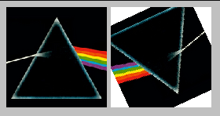

# Spike - Rotating Things

This is a simple spike showing how to [rotate a div "by hand"](./rotate_div.html). It then takes the basic rotation example, and shows how to [rotate each pixel of an image on a canvas](./rotate_img.html).

Interactive breakdown of the maths: [Desmos](https://www.desmos.com/calculator/acg6g5dfgo)

